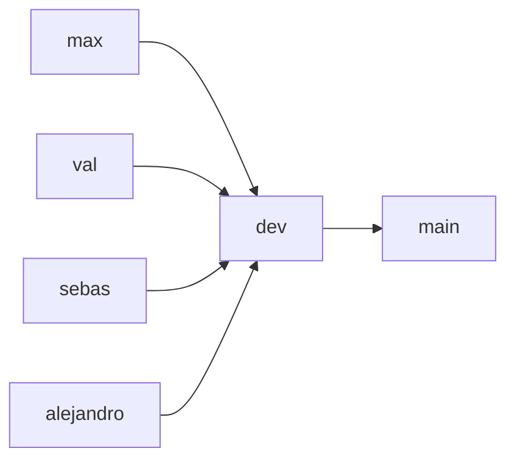

# Digitdeck · EAFIT SI4006

> **Tópicos Especiales y Aplicaciones en IA** · Universidad EAFIT · SI4006 · Semestre 2026-2

Repositorio de trabajo del equipo para el curso. El equipo es:

- Maximiliano Bustamante
- Valeria Frances Hornung
- Sebastián Castaño
- Alejandro Posada (`AlejandroSPosada`)

Este repositorio es privado y hermano de
[Digitdeck](https://github.com/Max-Bustamante69/Digitdeck). Contiene únicamente conocimiento,
material de clase y entregables del curso; no requiere acceso al cerebro comercial ni copia datos
de clientes.

## Sobre el proyecto

**Digitdeck** es un **copiloto de calidad de búsqueda para ecommerce en español**: detecta
consultas con resultados deficientes, **ordena productos por relevancia** y prepara
recomendaciones trazables para la persona responsable de ecommerce.

El trabajo se rastrea en
[GitHub Project · SI4006 Search Quality Copilot](https://github.com/users/Max-Bustamante69/projects/8).

Las rúbricas detalladas aún no han sido publicadas; nunca se inventan requisitos faltantes.

## Estructura del repositorio

```
gitEquipos/
├── Clases/                 # Material de clase (notebooks de la docente, sin modificar)
│   ├── M1/                 # S01–S04: Transformers, tokenizadores, fine-tuning con LoRA
│   └── M2/                 # S05–S06: Evaluación generativa
├── Datos/                  # Datasets, muestras y artefactos del proyecto
└── Entregables/            # Entregables del equipo, organizados por módulo
    ├── M1/                 # Fine-tuning de encoder para ranking de relevancia (S02–S04)
    ├── M2/                 # Evaluación generativa (S05–S06)
    ├── M3/                 # RAG, tool use, RAGAS (S07–S08, S10)
    ├── M4/                 # Componente visual: ViT, CLIP, difusión (S11–S13)
    └── M5/                 # Serving, eficiencia y MLOps (S14–S15)
```

La correspondencia de módulos sigue el mapa del curso (`M1 → M5`), de modo que cada entregable
queda alineado con la sesión y el peso de evaluación en los que se sustenta.

## Cómo trabajamos

- **`Clases/`** → notebooks originales de la docente, versionados tal como los distribuye. No
  se modifican; sirven de referencia para los entregables.
- **`Datos/`** → datasets, muestras y artefactos de datos. Los datasets pesados, pesos de
  modelo y outputs de experimentos **no se versionan** (`.gitignore`).
- **`Entregables/M1–M5/`** → trabajo propio del equipo: código, análisis y documentación de
  cada módulo. Cada carpeta tiene su propio `README.md` (contexto y rúbrica) y `TODO.md`
  (paso a paso en curso).

## Flujo de ramas



- `main`: entregas estables y aprobadas.
- `dev`: integración del equipo; toda colaboración entra aquí mediante PR.
- `max`, `val`, `sebas`, `alejandro`: ramas personales permanentes, actualizadas desde `dev`
  antes de cada tarea.
- Para trabajo grupal pueden crearse ramas cortas `feat/<tema>` desde `dev`.

## Fuente y licencias

El código propio del equipo es MIT. El material de clase en `Clases/` sigue la licencia docente
CC BY-NC-SA 4.0 de EAFIT SI4006 y se referencia, no se redistribuye.

## Fuente docente

La fuente docente está fijada por commit y fecha en
[`course/source-lock.json`](course/source-lock.json), con cada delta conservado en
[`course/sync-history.json`](course/sync-history.json).
El tablero estudiantil se encuentra en [`course/calendar.md`](course/calendar.md).