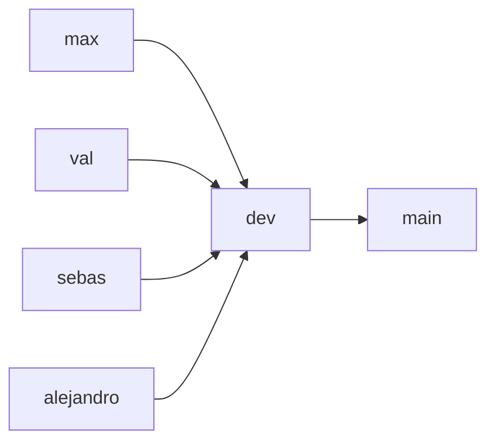

# Digitdeck · EAFIT SI4006

Cerebro académico y repositorio de trabajo para **Tópicos Especiales y Aplicaciones en IA**
(Universidad EAFIT, SI4006). El equipo es:

- Maximiliano Bustamante
- Valeria Frances Hornung
- Sebastián Castaño
- Alejandro Posada (`AlejandroSPosada`)

Este repositorio es privado y hermano de
[Digitdeck](https://github.com/Max-Bustamante69/Digitdeck). Contiene sólo conocimiento destilado y
seguro para el curso; no requiere acceso al cerebro comercial ni copia datos de clientes.

## Estado actual

- El equipo desarrolla un **copiloto de calidad de búsqueda para ecommerce en español**: detecta
  consultas con resultados deficientes, ordena productos por relevancia y prepara recomendaciones
  trazables para una persona responsable de ecommerce.
- El candidato eficiente de M1 es `intfloat/multilingual-e5-small`; se comparará bajo el mismo
  split y presupuesto con BM25 y XLM-R antes de adoptarlo.
- Fuente docente fijada por commit y fecha en [`course/source-lock.json`](course/source-lock.json),
  con cada delta conservado en [`course/sync-history.json`](course/sync-history.json).
- El tablero estudiantil está en [`course/calendar.md`](course/calendar.md) y el proyecto completo
  en [`project/README.md`](project/README.md).
- El trabajo se rastrea en
  [GitHub Project · SI4006 Search Quality Copilot](https://github.com/users/Max-Bustamante69/projects/8).
- Las rúbricas detalladas aún no han sido publicadas; nunca se inventan requisitos faltantes.

## Navegación

| Área | Contenido |
|---|---|
| [`course/`](course/) | Snapshot docente atribuido, currículo, evaluación y sincronización |
| [`course/sessions/`](course/sessions/) | S01–S16: ficha viva, recursos, código, resolución y evidencia por sesión |
| [`project/`](project/) | Definición, diseño y rutas prospectivas de M1–M5 y entrega final |
| [`knowledge/`](knowledge/) | Cerebro Markdown enlazado y grafo generado |
| [`.agents/skills/`](.agents/skills/) | Procedimientos compactos y autodescubribles para tareas recurrentes |
| [`team/`](team/) | Acuerdos, roles, reuniones y registro de contribuciones |
| [`individual/`](individual/) | Espacio de Max, Val y Sebas para trabajos individuales |
| [`tools/`](tools/) | Sync docente, query del cerebro y validación barata |

## Dónde va cada cosa

- Trabajo desarrollado en clase → `course/sessions/sXX/`.
- Entrega o tarea explícita → `course/assignments/Axx-slug/`.
- Rúbrica publicada y matriz propia → `course/rubrics/`.
- Definición y artefactos del proyecto solicitados → `project/`.
- Trabajo individual evaluable → `individual/<persona>/` en su rama personal.
- Acuerdos, reuniones y contribuciones reales → `team/`.
- Conocimiento reutilizable y decisiones durables → `knowledge/`.

Las etapas confirmadas del proyecto sí tienen una ruta prospectiva en `project/deliverables/`.
Cada ficha distingue `Confirmado` de `Preparación del equipo`; no se atribuyen a la docente formatos,
fechas calendario o criterios todavía no publicados.

## Flujo de ramas



- `main`: entregas estables y aprobadas.
- `dev`: integración del equipo; toda colaboración entra aquí mediante PR.
- `max`, `val`, `sebas`, `alejandro`: ramas personales permanentes, actualizadas desde `dev` antes
  de cada tarea.
- Para el proyecto grupal pueden crearse ramas cortas `feat/<tema>` desde `dev`.

Instrucciones completas: [`CONTRIBUTING.md`](CONTRIBUTING.md) y
[`team/working-agreement.md`](team/working-agreement.md).

## Inicio rápido

Los ejemplos usan `python` (Windows y entornos con alias). En Linux/macOS, usa `python3` si
`python` no existe; no cambia ningún argumento ni procedimiento.

```bash
# 1. Ver si la profesora publicó contenido nuevo
python -B tools/course_sync.py status

# Si cambió, ver únicamente commits y archivos posteriores al último cursor
python -B tools/course_sync.py changes

# Consultar sincronizaciones anteriores
python -B tools/course_sync.py history

# 2. Consultar sólo el conocimiento necesario
python -B tools/knowledge.py query "evaluación RAG del proyecto"

# 3. Validación local rápida antes de un PR
python -B tools/validate_repo.py
python -B -m unittest discover -s tests
python -B tools/knowledge.py validate
```

Los datasets, pesos, secretos y outputs de experimentos no se versionan. Cada entregable registrará
sus versiones y licencias cuando la docente publique el requisito correspondiente.

## Fuente y licencias

El código docente incluido es MIT; el material docente es CC BY-NC-SA 4.0. El snapshot inmutable
`course/upstream/` se conserva separado, atribuido y sólo para trabajo académico no comercial. Las
notas propias viven fuera de ese snapshot. Consulta [`NOTICE.md`](NOTICE.md).
